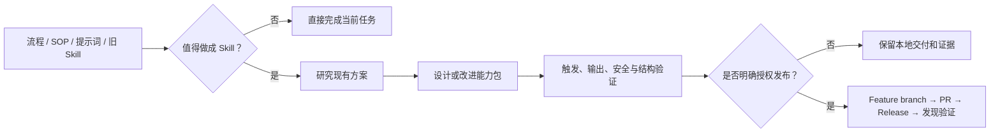

# Kang Meta Skill

> 把零散的流程、提示词、SOP 和经验，变成可发现、可测试、可维护、可发布的 Agent Skill。

[](https://github.com/KanG-ciyuan/kang-meta-skill/releases)
[](LICENSE)
[](https://github.com/KanG-ciyuan/kang-meta-skill/commits/main)

`kang-meta-skill` 是由 **Kang** 独立创建并维护的 Skill 工程与发布工作流。它不是一段一次性提示词，而是用来判断“什么值得做成 Skill”、研究现有方案、组织能力包、验证触发与输出边界，并在获得明确授权后安全发布到 GitHub 的通用 Meta Skill。

## 当前状态

| 项目 | 状态 |
|---|---|
| 公开版本 | `v1.0.0` |
| 定位 | Kang 独立创建并维护的通用 Meta Skill |
| 更新方式 | 人工审查、测试、Pull Request 和版本发布 |
| 开源协议 | MIT |

## 为什么需要它

很多所谓的 Skill，实际上只是把一段长提示词放进 `SKILL.md`。它们可能缺少清晰的触发边界、可复现的测试、真实输出合约和可审查的发布过程，最后很难判断它什么时候该被调用，也难以稳定维护。

`kang-meta-skill` 会把 Skill 当成一个需要设计、研究、验证和治理的可复用能力包，重点解决以下问题：

- 这个任务究竟值不值得做成 Skill；
- 现有公开 Skill 和源代码里有哪些机制值得借鉴；
- 哪些内容应该放在根 `SKILL.md`，哪些应该拆到 `references/`、`scripts/`、`evals/` 和 `reports/`；
- 自然语言触发是否准确，是否会误触发或漏触发；
- README 和发布声明是否有真实证据，而不是过度包装；
- 修改、GitHub 发布和本地安装是否遵守用户的授权边界。

## 它会做什么



1. **意图判断**：识别重复性、用户、输入、输出、排除项和权限边界。
2. **现有方案研究**：使用多个可用来源搜索相关 Skill，区分采用度、仓库指标和真实质量证据。
3. **能力包设计**：创建新 Skill，或改进、迁移、审计现有 Skill，只创建真正必要的文件。
4. **触发与输出评测**：检查正例、反例和近邻任务，避免 Skill 什么都管或该管的不管。
5. **结构与信任验证**：检查根入口、元数据、上下文成本、秘密风险、证据声明和回滚边界。
6. **受控发布**：只在用户明确要求时，通过功能分支、Pull Request、版本 Release 和发现检查发布。

## 它会交付什么

交付物会随任务规模变化，不为了看起来完整而创建空目录。一个可公开发布的完整能力包通常包含：

```text
your-skill/
├── SKILL.md                 # Agent 读取的路由和核心工作流
├── README.md                # 面向使用者的公开产品说明
├── agents/interface.yaml    # 显示名称、默认提示和权限边界
├── evals/                   # 触发与输出测试用例
├── references/              # 需要时才加载的判断与方法
├── scripts/                 # 可重复执行的研究、验证和发布工具
└── reports/                 # Skill IR、研究、评测与发布证据
```

| 工作模式 | 适用场景 | 典型交付 |
|---|---|---|
| `Scaffold` | 个人探索、早期验证 | 可触发的 `SKILL.md` 和最小必要说明 |
| `Production` | 稳定复用、团队使用 | README、接口、触发评测和输出合约 |
| `Library` | 跨平台、长期维护 | Skill IR、可移植边界、信任和复审机制 |
| `Governed` | 公开、高信任或高风险 | 权限、回滚、秘密、发布和声明门禁 |

## 适合与不适合

| 适合使用 | 不应做成 Skill |
|---|---|
| 一个流程会在多个项目或多次任务中重复出现 | 只需要完成一次的摘要、翻译或问答 |
| 需要统一 Agent 的判断、输出、安全或发布方式 | 一条简单提示就能稳定完成的任务 |
| 需要研究已有 Skill，再经过取舍形成独立能力包 | 只与单个项目紧密绑定的内部约定 |
| 需要可测试、可追溯、可回滚的长期维护 | 可以用程序或校验器直接强制的纯机械规则 |

## 你可以直接这样说

- “把这套重复流程整理成我的 Kang Skill。”
- “先研究现有的相关 Skill，说明保留、改造和放弃了什么，再创建新 Skill。”
- “帮我改进这个 Skill 的触发边界、输出质量和测试证据。”
- “只审计这个 Skill，先不要修改任何文件。”
- “把这个 Skill 发布到 GitHub，但不要安装或同步到本机。”

## 安装

使用支持 Agent Skills 的工具安装：

```bash
npx skills add KanG-ciyuan/kang-meta-skill --skill kang-meta-skill
```

验证安装结果：

```bash
test -f ~/.agents/skills/kang-meta-skill/SKILL.md
python3 ~/.agents/skills/kang-meta-skill/scripts/validate_skill.py ~/.agents/skills/kang-meta-skill
```

## 前置条件

- [ ] Python 3：用 `python3 --version` 检查，用于研究、验证和评测脚本。
- [ ] Node.js 和 `npx`：用 `node --version` 与 `npx --version` 检查，用于公开 Skill 发现。
- [ ] Git：用 `git --version` 检查，用于版本管理。
- [ ] GitHub 命令行工具：只在发布时需要，使用 `gh auth status` 确认身份状态。
- [ ] 用户明确授权：发布、安装、同步或其他外部写入操作前必须单独确认。

## 配置与权限

创建、审计和本地验证不需要 API Key。仅当执行外部搜索或 GitHub 发布时，才会使用当前环境中已授权的公开网络或 GitHub 会话。

| 能力 | 默认行为 | 边界 |
|---|---|---|
| 读取本地素材 | 仅限任务需要的文件 | 不输出密钥、Cookie、认证文件或私密路径 |
| 修改文件 | 仅在用户要求创建或改进时 | 审计、评估和诊断请求保持只读 |
| 公开网络 | 只读研究 | 不为研究直接执行来源不明的第三方代码 |
| GitHub 写入 | 默认关闭 | 需要明确发布授权，禁止直接推送默认分支 |
| 生成 Skill 的安装 | 默认关闭 | 需要与发布分开的明确请求 |

## 验证记录

`v1.0.0` 的公开发布证据：

| 检查 | 结果 | 证据边界 |
|---|---:|---|
| 单元测试 | **35 / 35** 通过 | 验证本地脚本、身份、研究与发布合约 |
| 触发用例 | **23 / 23** 通过 | 覆盖正例、反例和近邻请求 |
| 包结构验证 | 0 warnings | 验证入口、必要文件、README 和元数据 |
| 密钥与身份扫描 | 通过 | 检查公开包中的秘密风险和他人身份信息 |
| GitHub 发现 | 发现 1 个 Skill | 确认仓库根入口可被识别 |

在仓库根目录重新运行：

```bash
python3 -m unittest discover -s tests -v
python3 scripts/validate_skill.py .
python3 scripts/trigger_eval.py . --cases evals/trigger_cases.json
python3 scripts/release_check.py . --phase local --run-tests
```

这些证据说明当前版本通过了已定义检查，不代表它在所有环境和任务中都能产生相同结果。

## 版本与维护

本项目通过人工审查、自动化测试和版本发布进行维护。每次更新应当：

1. 说明预期能力和使用者影响；
2. 为新行为增加可复现的测试；
3. 完成最小必要改动并重新验证；
4. 通过功能分支、Pull Request 和新版本发布，不覆盖已发布版本。

## Troubleshooting

| 问题 | 可能原因 | 处理方式 |
|---|---|---|
| `No valid skills found` | YAML frontmatter 无效，或仓库路径不包含根 `SKILL.md` | 运行 `python3 scripts/validate_skill.py .` 并检查根入口 |
| Skill 没有按预期触发 | `description` 、正反例和使用话术不一致 | 调整触发边界后重新运行 `trigger_eval.py` |
| 外部 Skill 搜索失败 | 目录、网络或公开仓库不可用 | 继续使用其他可核实来源，并将缺口标记为 `missing evidence` |
| 发布门禁阻止 | 缺少证据、分支不正确、版本重用或存在秘密风险 | 修复门禁报告指出的原因，不绕过检查 |
| GitHub 已发布但本机找不到 | 公开仓库不等于已安装 | 执行安装命令，再检查 Skill 目录 |

## License

MIT License. Copyright (c) 2026 Kang.

<!-- kang-author:start -->
## About Kang

Created and maintained by **Kang**. GitHub: https://github.com/KanG-ciyuan/
<!-- kang-author:end -->
