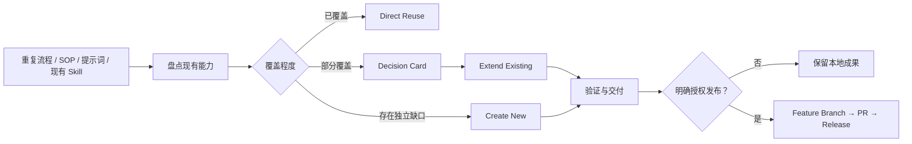

# Kang Meta Skill

> 先盘点可复用能力，再决定直接复用、扩展现有 Skill，还是创建新 Skill。

[](https://github.com/KanG-ciyuan/kang-meta-skill/releases)
[](LICENSE)
[](https://github.com/KanG-ciyuan/kang-meta-skill/commits/main)

`kang-meta-skill` 是由 **Kang** 创建并维护的个人 Meta Skill。它负责把重复流程、提示词、SOP、脚本和已有 Skill 整理成可发现、可测试、可维护、可发布的能力包，同时阻止没有必要的重复造 Skill。

> [!IMPORTANT]
> `v2.0.0` 已升级为 Kang 的正式个人 Meta Skill。仓库发布与本机启用是两项独立操作：当前发布不会自动替换或移除任何已安装 Skill。

## 当前状态

| 项目 | 状态 |
|---|---|
| 版本 | `v2.0.0` |
| 定位 | Kang 个人维护的通用 Skill 工程系统 |
| 核心策略 | 复用优先，存在主要能力时不重复创建 |
| 维护方式 | 人工评审、自动校验、Pull Request、版本化 Release |
| 运行时切换 | 本次暂缓，不自动安装到全局目录 |
| 开源协议 | MIT，版权归 Kang |

## 为什么需要它

创建 Skill 的真正成本不只是写一份 `SKILL.md`，还包括触发边界、上下文占用、重复能力、测试维护和发布风险。若每遇到一个相似需求就创建新 Skill，调用会越来越混乱，维护也会越来越重。

`kang-meta-skill` 在开始设计前先回答三个问题：

1. 当前 Meta Skill 是否已经内置这项能力？
2. 已安装 Skill 或 Kang 的现有仓库是否已经覆盖主要工作？
3. 剩余差异值得扩展现有能力，还是确实需要一个独立 Skill？

只有明确存在独立、长期、可复用的能力缺口时，才进入新 Skill 创建流程。

## 它会做什么



### 复用决策

- **Direct Reuse**：现有能力已覆盖主要工作，直接调用，不创建新 Skill。
- **Extend Existing**：核心职责相同但存在稳定缺口，优先扩展已有 Skill。
- **Create New**：职责、触发边界或交付物明确独立，才创建新 Skill。
- **Decision Card**：部分重叠时暂停实施，列出覆盖项、缺口、推荐动作和代价，由用户确认。

### 完整工程能力

- 判断任务是否值得沉淀为可复用 Skill；
- 研究可用能力并区分采用度、质量证据、维护状态与安全边界；
- 设计根入口、按需引用、确定性脚本、评测用例和证据报告；
- 验证正例、反例、近邻请求、输出质量、上下文成本和秘密风险；
- 审计或迁移已有 Skill，而不把一次性文档任务强行升级成新 Skill；
- 在用户明确授权后，通过功能分支、Pull Request 和不可变版本发布。

## README 边界

| 请求 | 处理方式 |
|---|---|
| 为 Agent Skill 编写 README | 使用本 Meta Skill 内置 README 流程 |
| 修改普通项目或产品仓库 README | 直接完成 README 工作，不触发 Meta Skill |
| 用户只要一次性排版优化 | 不创建新的 README Skill |
| README 需求形成独立、长期、跨项目规则 | 先走复用决策，再判断是否扩展现有能力 |

## 它会交付什么

交付物按风险和复用范围动态选择，不创建空目录或仪式性文件。

```text
your-skill/
├── SKILL.md                 # 唯一可发现的根入口
├── README.md                # 共享或公开时的使用说明
├── agents/interface.yaml    # 显示名称、默认提示与权限边界
├── evals/                   # 触发与输出测试用例
├── references/              # 按需加载的判断方法
├── scripts/                 # 可重复执行的验证和发布工具
└── reports/                 # 评测与发布证据
```

| 模式 | 适用场景 | 典型交付 |
|---|---|---|
| `Scaffold` | 个人探索、早期验证 | 可触发的根入口和最小必要说明 |
| `Production` | 稳定复用、团队使用 | README、接口、触发评测、输出合约 |
| `Library` | 跨平台、长期维护 | Skill IR、可移植边界、信任与复审机制 |
| `Governed` | 公开、高信任或高风险 | 权限、回滚、秘密、声明和发布门禁 |

## 适合与不适合

| 适合使用 | 不应触发 |
|---|---|
| 创建、升级、迁移、评估或发布 Agent Skill | 一次性摘要、翻译、问答或普通文档 |
| 需要判断是否复用、扩展或新建 Skill | 普通前端开发、代码修复或仓库维护 |
| 需要触发评测、输出评测、发布门禁 | 已有能力可以直接完成的单次任务 |
| 需要整理跨项目长期复用的方法 | 只属于单个项目的局部约定 |

## 你可以直接这样说

- “先盘点已有能力，再判断这件事需不需要创建 Skill。”
- “把这套重复流程整理成我的 Kang Skill。”
- “这个需求与现有 Skill 部分重叠，先给我 Decision Card。”
- “优化这个已有 Skill，补全触发评测和发布门禁。”
- “只审计这个 Skill，先不要修改文件。”
- “发布到 GitHub，但不要安装或同步到本机。”

## 安装

```bash
npx skills add KanG-ciyuan/kang-meta-skill --skill kang-meta-skill
```

安装完成后可检查：

```bash
test -f ~/.agents/skills/kang-meta-skill/SKILL.md
python3 ~/.agents/skills/kang-meta-skill/scripts/validate_skill.py ~/.agents/skills/kang-meta-skill
```

> 安装、替换、同步和移除已安装 Skill 都需要单独授权。公开仓库或发布 Release 不会自动改变本机运行时。

## 前置条件

- Python 3：运行研究、验证和评测脚本；
- Node.js 与 `npx`：需要公开 Skill 发现时使用；
- Git：管理版本与功能分支；
- GitHub CLI：仅在明确要求发布时使用；
- 对应的文件、网络和外部写入权限。

## 配置与权限

创建、审计和本地验证不要求 API Key。外部检索或 GitHub 发布只使用当前环境已授权的会话，不读取、显示或提交真实密钥。

| 能力 | 默认行为 | 边界 |
|---|---|---|
| 读取本地素材 | 仅限任务需要 | 不输出密钥、Cookie、认证文件或私密路径 |
| 修改文件 | 仅限用户要求创建或改进的包 | 审计、评估和诊断请求保持只读 |
| 公开网络 | 只读能力研究 | 不执行来源不明的脚本或安装器 |
| GitHub 写入 | 默认关闭 | 需明确授权，禁止直接推送默认分支 |
| 本地安装 | 与发布分离 | 未明确要求时不写入全局 Skill 目录 |

## 验证记录

`v2.0.0` 当前本地证据：

| 检查 | 结果 | 证据边界 |
|---|---:|---|
| 单元测试 | **47 / 47** 通过 | 覆盖复用门槛、身份、结构、研究、评测和发布合约 |
| 触发用例 | **23 / 23** 通过 | 覆盖正例、反例和近邻请求 |
| 包结构验证 | 0 failures / 0 warnings | 验证入口、必要文件、README 与元数据 |
| 身份与品牌扫描 | 通过 | 阻止第三方个人署名、账号、头像、二维码和品牌注入 |
| 六类复用评测 | **6 / 6** 通过 | 决策与暂停行为均匹配预期 |
| GitHub Release | 待发布后核验 | 不提前声称远程发布完成 |
| 隔离安装 | 待发布后核验 | 仅在临时目录验证，不切换本机运行时 |

在仓库根目录重新运行：

```bash
python3 -m unittest discover -s tests -v
python3 scripts/validate_skill.py .
python3 scripts/trigger_eval.py . --cases evals/trigger_cases.json
python3 scripts/release_check.py . --phase local --run-tests
```

## 维护规则

1. 新需求先盘点现有能力，不因局部重叠创建新 Skill；
2. 行为变更先增加失败用例，再修改规则并回归测试；
3. 公开声明只描述可验证的当前能力和证据；
4. 每次发布使用新版本，通过功能分支、Pull Request 和 Release；
5. 发布、安装和运行时切换分别授权，不互相隐含。

## Troubleshooting

| 问题 | 可能原因 | 处理方式 |
|---|---|---|
| `No valid skills found` | YAML frontmatter 无效或根入口缺失 | 运行 `validate_skill.py` 并检查根 `SKILL.md` |
| Skill 没有按预期触发 | 描述、正反例和实际话术不一致 | 调整触发边界并重新运行触发评测 |
| 重复建议创建新 Skill | 未完成复用盘点或忽略部分重叠 | 强制输出 Decision Card，再选择复用、扩展或新建 |
| 能力检索不可用 | 网络、目录或公开仓库暂时不可用 | 使用本地盘点结果，标记缺失证据，不假装已完成研究 |
| 发布门禁阻止 | 证据不足、分支错误、版本重用或秘密风险 | 修复报告指出的问题，不绕过门禁 |
| GitHub 已发布但本机未生效 | 发布不等于安装或运行时切换 | 仅在明确授权后执行安装或切换 |

## License

MIT License. Copyright (c) 2026 Kang.

<!-- kang-author:start -->
## About Kang

Created and maintained by **Kang**. GitHub: https://github.com/KanG-ciyuan/
<!-- kang-author:end -->
